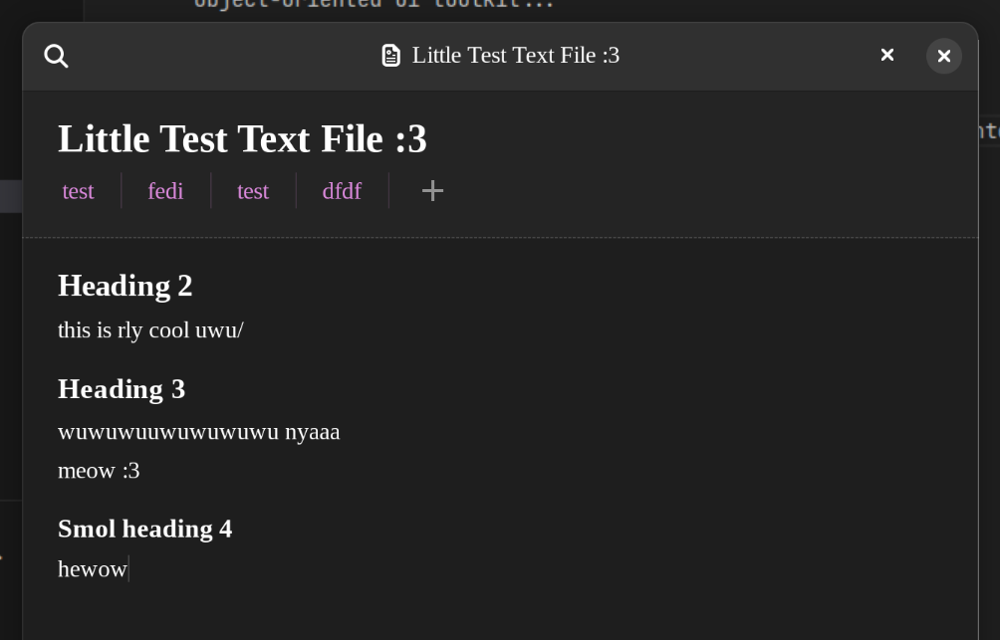

# Papier

This is a little app im making to replace [Paper](https://gitlab.com/posidon_software/paper), which is an app I made previously, but it's buggy and I don't like it

This app is also buggy, maybe I'll give up on using gtk and.. idk, maybe ill roll my own, non-(excessively-)object-oriented ui toolkit...

but for now u got this app.

Also I wanted to add table support, but it's not fully implemented yet